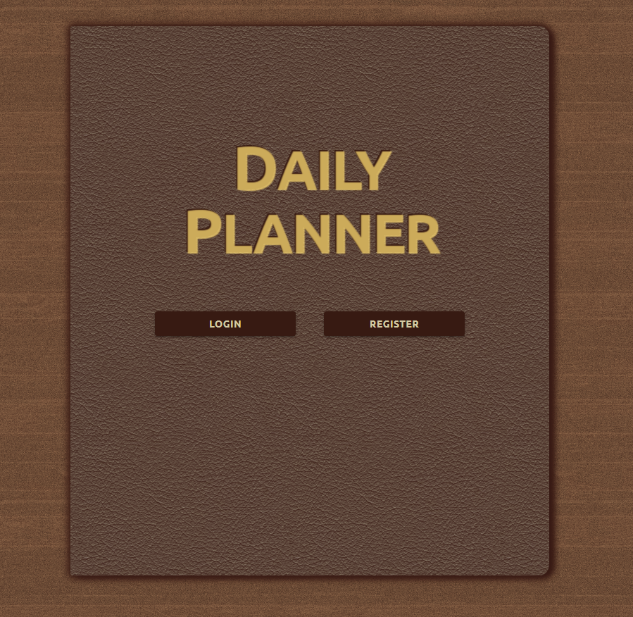
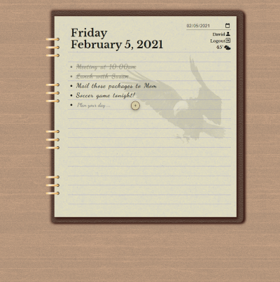

# Leather Day Planner App

I built this app as a pet project. I took the requisite to-do app that many budding developers build when learning a programming language, and built a robust set of features into it making it a handy and useful way to stay organized in my work and home life. All packaged into the design of a realistic-looking leather planner.

## Technology Stack

- MongoDB
- Express
- React.js
- Node.js
- JSON Web Token
- Heroku

## Description

This app features full desktop and mobile responsiveness,
and has the elegant, classic design of an old-school leather planner.

Users can login or register their account (for free!), and will then be redirected to the list for the current day. From there, they can use the calendar date picker to see the lists for any other day and review or make changes to them.

### Features

- Each user manages a different list for every day of the year.
- Full CRUD operations on list items with more helpful features:
  - Users can cross off items indicating completion.
  - List items can be copied over to the next day.
  - Additional notes can be added to any list item.
- User information can be updated from the profile page.
  - Password changes
  - Updates to email address
  - Changes to user display name
- A weather widget that can get the temperature and weather for any city.
- Skeumorphism design
- In-app toast notifications for success and error responses

### Logic and Data flow

- Global app state is managed with the Context API.
- List and login information is persisted with a MongoDB database.
- Passwords are encrypted and securely stored.
- Authentication is managed with a JSON Web Token appended to request headers.
- Database actions are handled with Mongoose atomic operations.
- API requests are asynchronous to keep the front end UX seamless during updates.

### Hosting

The current version of this application is live and can be found at https://leather-journal.herokuapp.com
