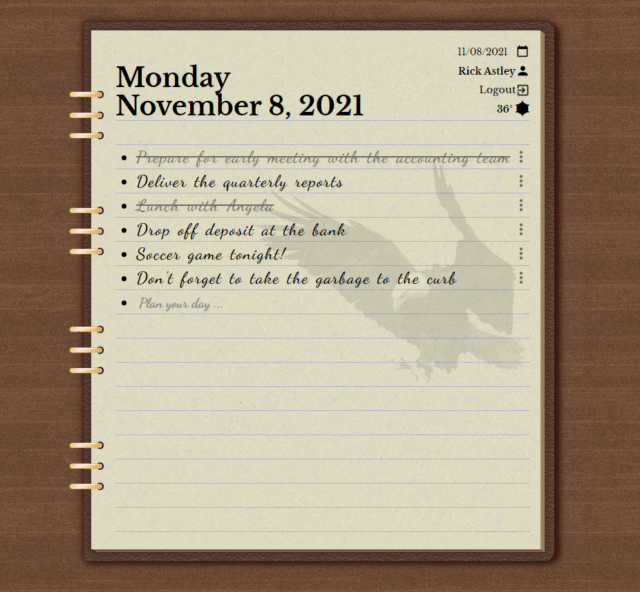

# Leather Day Planner App

This app features full desktop and mobile responsiveness,
and has the elegant, classic design of an old-school leather planner.

## Technology Stack

- MongoDB
- Express
- React.js
- Node.js

## Description

Users will be directed to login or register their account, and be redirected to the list for the current day.

From there, they can use the calendar date picker to see the lists for any other
day and make changes to them.

List items are saved immediately to the database, and are crossed off upon clicking on the text.  
The items are not deleted, but are saved with their crossed off state to give users the ability to look into the past to see which items were or weren't completed on any given day.

### Logic and Data flow

Global app state is managed with the Context API.  
List and login information is persisted with MongoDB, and passwords are encrypted with JSON Web Tokens.  
This app includes a weather widget that asks for the user's town to get the weather for the local area and display it with OWFont iconography.

### Hosting

The current version of this application can be found at https://leather-journal.herokuapp.com
